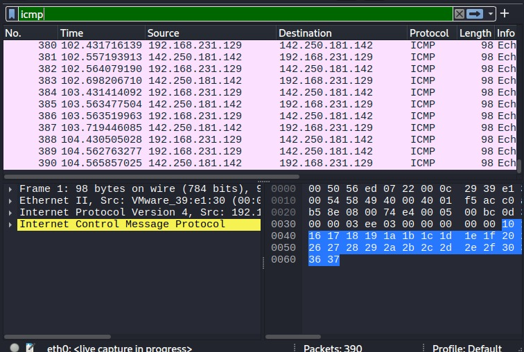

# Network Traffic Analysis

## Objective
To capture and analyze network traffic using Wireshark and identify ICMP packets generated during network communication.

## Tools Used
- Wireshark
- Kali Linux

## Traffic Generation
Network traffic was generated using the ping command to send ICMP packets to a remote server.

Command used:

ping google.com

## Packet Capture
Wireshark was used to capture network packets from the active network interface.

## ICMP Traffic Investigation

The ICMP display filter was applied to isolate ping request and reply packets.

## Findings
The captured packets revealed ICMP echo requests and echo replies between the local machine and a remote server.

Source IP: 192.168.x.x  
Destination IP: 142.x.x.x  
Protocol: ICMP

This demonstrates how network diagnostic tools like ping generate ICMP traffic that can be analyzed using Wireshark.

## Skills Demonstrated
- Packet capture
- Network traffic analysis
- Protocol filtering
- Packet investigation

- 
