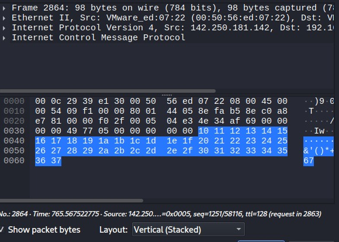
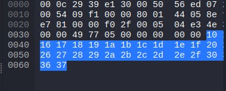

# Wireshark Network Traffic Analysis

## Objective
The objective of this lab is to capture and analyze network traffic using Wireshark and identify ICMP packets generated during network communication.

## Tools Used
- Wireshark
- Kali Linux

## Traffic Generation
Network traffic was generated using the `ping` command to produce ICMP packets for analysis.

Command used:

ping google.com

## Packet Capture
Wireshark was launched to capture packets from the active network interface (eth0).

## ICMP Packet Filtering
The display filter `icmp` was applied in Wireshark to isolate ICMP packets generated from the ping command.

## Packet Frame Details
The captured packet was inspected to analyze frame information and protocol structure including Ethernet, IPv4, and ICMP.

## Packet Hex Data
The raw packet bytes were examined to observe the hexadecimal representation of the network packet.

## Findings
The analysis revealed ICMP echo request and echo reply packets exchanged between the local host and a remote server.  
This demonstrates how ICMP is used for network diagnostics and how packet capture tools can be used to investigate network communication.

## Skills Demonstrated
- Packet capture using Wireshark
- Protocol filtering
- Network traffic investigation
- Packet structure analysis
