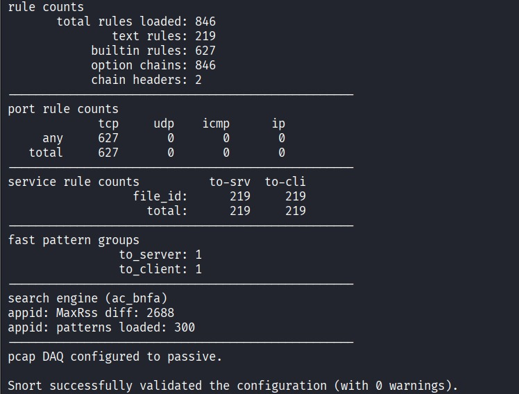
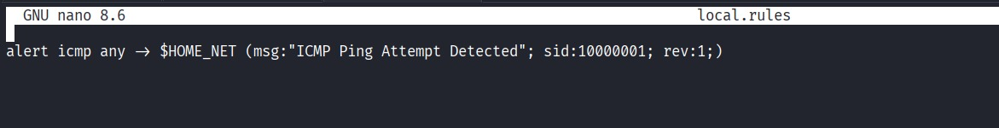
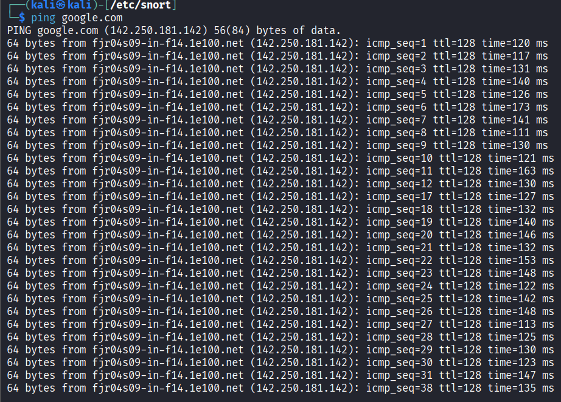
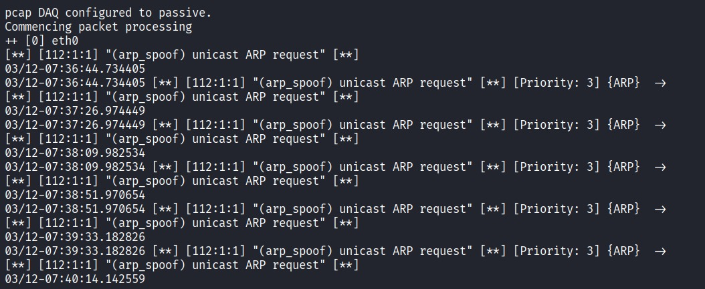

# Snort Intrusion Detection Lab

## Objective
To configure and monitor Snort IDS to detect suspicious network traffic.

## Tools Used
- Snort
- Kali Linux

## Steps Performed

1. Installed and configured Snort IDS.
2. Monitored network traffic.
3. Created detection rules.
4. Analyzed IDS alerts.

## Findings

Snort generated alerts when suspicious traffic patterns were detected, demonstrating how intrusion detection systems identify potential attacks.

## Skills Demonstrated

- Network monitoring
- IDS rule analysis
- Threat detection## Snort Configuration Validation
  
## Snort Configuration Validation

## Snort Detection Rule

## Snort Monitoring

## Live Alert Monitoring
The screenshot below shows Snort actively detecting network activity during packet inspection.

